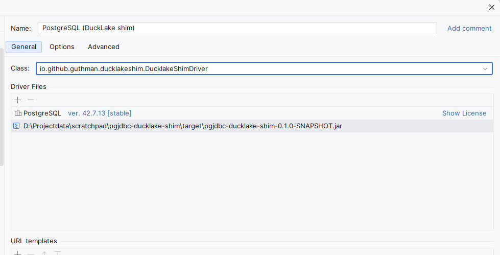

# pgjdbc-ducklake-shim

Lets DataGrip open [pg_ducklake](https://github.com/relytcloud/pg_ducklake) tables in the table editor.

## Problem

For a table without a primary key, DataGrip appends `ctid` to its query. DuckLake tables have no `ctid`, so the query fails:

```
[XX000] ERROR: (PGDuckDB/CreatePlan) Prepared query returned an error: Binder Error: Referenced column "ctid" not found in FROM clause!
```

DataGrip already retries without `ctid` when the error text contains `column "ctid" does not exist`, which is the error Postgres itself returns. pg_ducklake uses different wording, so the retry never fires.

- DataGrip: [DBE-27211](https://youtrack.jetbrains.com/issue/DBE-27211/Data-editor-ctid-fallback-does-not-trigger-for-pgducklake-tables)
- pg_ducklake: [relytcloud/pg_ducklake#234](https://github.com/relytcloud/pg_ducklake/issues/234)

Once DataGrip adds pg_ducklake's wording to its list, you don't need this shim.

## Fix

This driver wraps pgjdbc. When it sees that one DuckDB error, it appends `[column "ctid" does not exist]` to the message. It passes every other error and call through unchanged. The original exception is kept as the cause. It's an inelegant workaround, but it's the best we can do.

## Install in DataGrip

### 1. Get the jar

Build it with `mvn package` (you get `target/pgjdbc-ducklake-shim-*.jar`), or download it from [Releases](https://github.com/Guthman/pgjdbc-ducklake-shim/releases).

### 2. Create the driver

1. Go to **Database Explorer → Drivers**, right-click **PostgreSQL**, choose **Duplicate**, and name the copy `PostgreSQL (DuckLake shim)`.
   The copy keeps DataGrip's own pgjdbc, so you don't need to add pgjdbc yourself.
2. Under **Driver Files**, choose **+ → Custom JARs…** and add the shim jar.
3. Set **Class** to `io.github.guthman.ducklakeshim.DucklakeShimDriver` (it should appear in the dropdown).
4. Leave the dialect as PostgreSQL. DataGrip only retries without `ctid` when it treats the connection as Postgres.



### 3. Create the data source from the driver page

On the shim driver's page, click **Create Data Source** and enter your pg_ducklake connection details. URLs are ordinary `jdbc:postgresql://…` URLs.

> **Don't duplicate an existing Postgres data source.** A duplicated data source may not list the shim in its **Driver** dropdown. **Create Data Source** from the driver page does work, but you have to enter the connection details again.

### 4. Check it

Open a DuckLake table. You should see rows. You might see the original error message flash by before DataGrip automatically retries (which is the behavior we want here).

### Notes

- The driver does not register with `DriverManager`, so having it on a classpath never takes over plain Postgres connections.
- When you replace the jar, disconnect the data source first. Windows keeps the jar locked while DataGrip is connected.

## Test

```bash
mvn test     # offline unit tests
mvn verify   # plus integration tests against a throwaway pg_ducklake container (needs Docker)
mvn verify -Dducklake.image=pgducklake/pgducklake:18-main   # against pg_ducklake's latest build
```

The integration tests start `pgducklake/pgducklake`, create a DuckLake table, a view over it and a heap copy, then check:

- With plain pgjdbc, DataGrip's table-editor sequence fails on the DuckLake table (the bug).
- With the shim, the same sequence returns the rows (the fix).
- `ctid`, `CTID`, `t.ctid` and `"ctid"` are all translated, on both the plain statement path and the prepared-statement path with cursor fetch.
- Other errors are left alone: other DuckDB binder errors, Postgres' own view error, and `ctid` on heap tables.
- pgjdbc-specific APIs (`PGConnection`, `unwrap`) still work through the wrapper.

[`DataGrip`](src/test/java/io/github/guthman/ducklakeshim/DataGrip.java) mirrors DataGrip's decision logic (row-id rule, error formatting, `isRowIdError` substring list), as decompiled from DB-262.10315.132.

## Debug inside DataGrip

In the data source, open **Advanced → VM options** and add
`-agentlib:jdwp=transport=dt_socket,server=y,suspend=n,address=127.0.0.1:5005`, then reconnect and attach a debugger to port 5005. VS Code users can use the included **Attach: DataGrip driver JVM** launch configuration.

## License

BSD 2-Clause, same as [pgjdbc](https://github.com/pgjdbc/pgjdbc/blob/master/LICENSE). The jar does not bundle pgjdbc.
